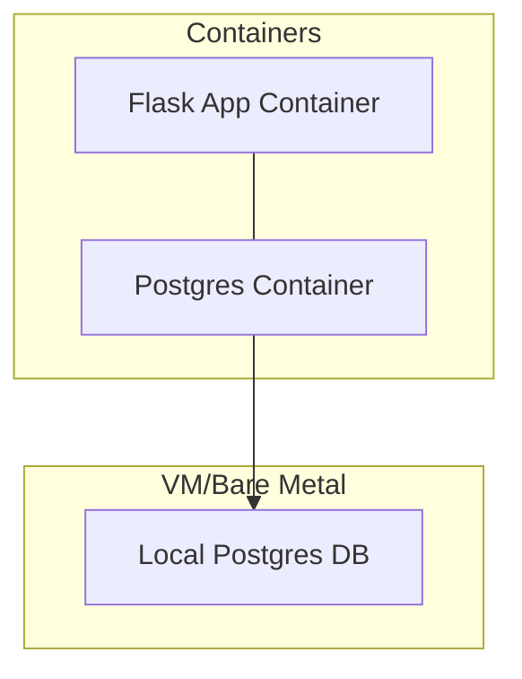

# X-COM: UFO Defense

## Machine Dependencies

```
apt install postgresql postgresql-contrib
```




## Deployment

This section concerns everything handled by a Docker containers.

Setting up containers and networks is handled by docker-compose.

### Things You'll Need

* Docker CE
* Docker Compose

### Install Docker

First and foremost we'll need to install Docker CE. As mentioned in the main
README I'm running x64 Debian 9 thus the following commands are Debian-specific.

```shell
# Install Pre-Reqs
sudo apt-get update
sudo apt-get install \
    apt-transport-https \
    ca-certificates \
    curl \
    gnupg-agent \
    software-properties-common
curl -fsSL https://download.docker.com/linux/debian/gpg | sudo apt-key add -
sudo apt-key fingerprint 0EBFCD88
sudo add-apt-repository \
   "deb [arch=amd64] https://download.docker.com/linux/debian \
   $(lsb_release -cs) \
   stable"

# Install Docker CE
sudo apt-get update
sudo apt-get install docker-ce
```

### Install Docker Compose

```shell
sudo curl -L "https://github.com/docker/compose/releases/download/1.23.2/docker-compose-$(uname -s)-$(uname -m)" -o /usr/local/bin/docker-compose
## Make the binary executable
sudo chmod +x /usr/local/bin/docker-compose
```

### Provisioning

#### Set-Up

Run the following command while in the same directory as the `docker-compose.yml`
file.

```shell
sudo docker-compose up -d
```

#### Tear Down

Note this will remove *all* containers, networks, and drives not mapped to
a host volume.

```shell
sudo docker-compose down
```

## Populating the Database

The included `data_munging_tools/csv_to_SQL.sh` script will dump data from the included
CSV file into a Postgres database on our local machine.

## Accessing the App

The app will expose port `5000` and the following endpoints:

* `/total_sightings`: Total number of UFO sightings.
* `/unique_ship_shapes`: Total number of unique shapes of alien ships across all sightings.
* `/evac_priorties`: Top-10 Cities in the United States with the most UFO sightings in descending order.
* `/closest_to_area_52`: Information about UFO sightings closest to Area 52.
